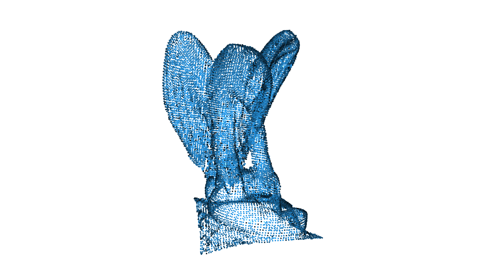

# Open3dRenderDemo
An example of processing the Eagle demo data from Open3d and rendering it.

## Setting up the environment

Create and activate a Python virtual environment, then install Open3D:

(Note: This uses venv and pip, but feel free to use any env and package manager that you prefer.)

```bash
python3 -m venv .venv
source .venv/bin/activate
pip install --upgrade pip
pip install -r requirements.txt
pre-commit install
```

## Content of the demo

The demo will load the example EaglePointCloud dataset from Open3d.

It will then perform the following steps:

### Apply a down-sampling filter to reduce the number of points while preserving geometric structure

The downsampled cloud with the current settings looks like this:


### Estimate surface normals for the downsampled point cloud

The estimated normals on the downsampled cloud with the current settings look like this:


### Perform Euclidean clustering to separate the scene into individual components

The segmentation (clustering) result with the current settings looks like this:



## Running the demo

You can run the example pipeline with:

```bash
# default (show visualizations, no image saving)
python src/pipeline_controller.py

# show visualizations and save images
python src/pipeline_controller.py --save_plots
# don't show visualizations and save images
python src/pipeline_controller.py --no_show --save_plots
# no showing, no image saving (helpful for debugging)
python src/pipeline_controller.py --no_show
# overwrite the images used in this Readme
python src/pipeline_controller.py --update_readme_images
```

## Testing

This repo uses pytest for unit tests.

You can simply run the tests with

```bash
pytest tests/
```

It will automatically discover tests in files named `test_*.py` or `*_test.py`.
