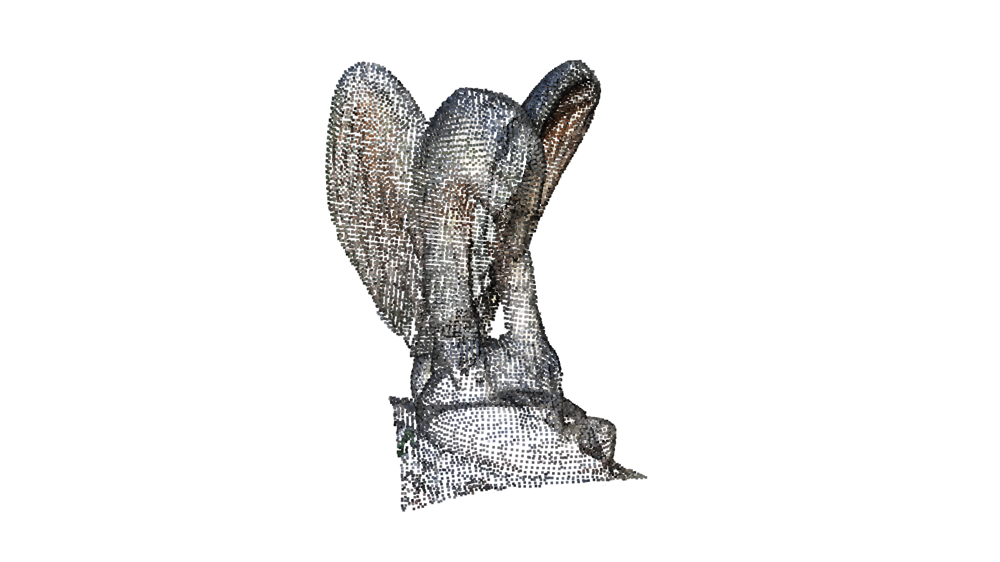
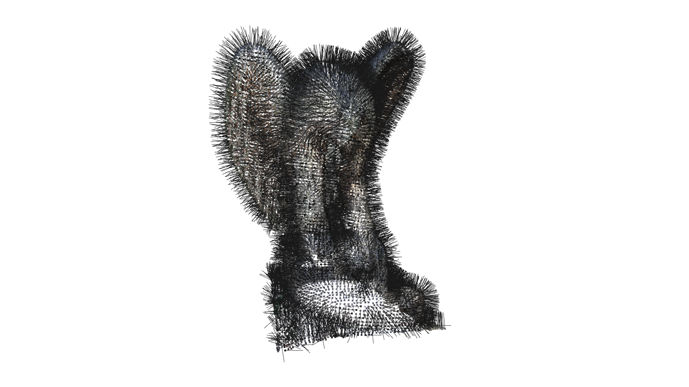
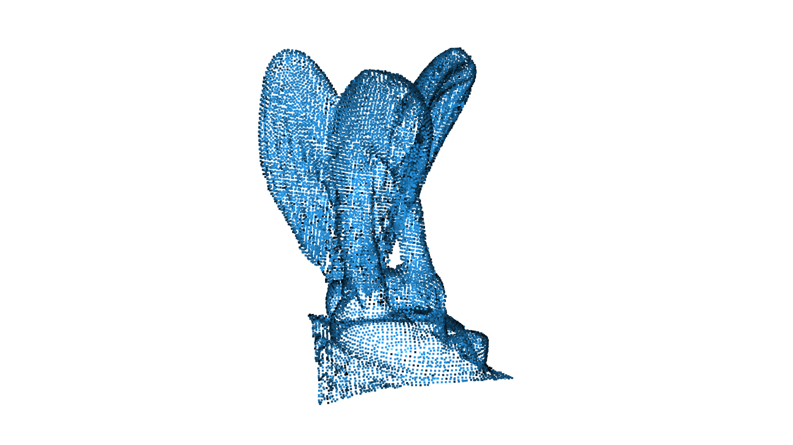

# Open3dRenderDemo
An example of processing the Eagle demo data from Open3d and rendering it.

## Setting up the environment

Create and activate a Python virtual environment, then install Open3D:

(Note: This uses venv and pip, but feel free to use any env and package manager that you prefer.)

```bash
python3 -m venv .venv
source .venv/bin/activate
pip install --upgrade pip
pip install -r requirements.txt
pre-commit install
```

## Content of the demo

The demo will load the example EaglePointCloud dataset from Open3d.

It will then perform the following steps:

### Apply a down-sampling filter to reduce the number of points while preserving geometric structure

The downsampled cloud with the current settings looks like this:



### Estimate surface normals for the downsampled point cloud

The estimated normals on the downsampled cloud with the current settings look like this:



### Perform clustering to separate the scene into individual components

The example runs two different clustering algorithms: euclidean and k-means.

Euclidean clustering mostly just results in one big cluster for the Eagle dataset, due to its continuous surfaces.

K-means is able to cluster the Eagle dataset into more meaningful components, like wings or legs.

Result of euclidean clustering with current settings:



Result of k-means clustering with current settings:


## Running the demo

You can run the example pipeline with:

```bash
# default (show visualizations, no image saving)
python src/pipeline_controller.py

# show visualizations and save images
python src/pipeline_controller.py --save_plots
# don't show visualizations and save images
python src/pipeline_controller.py --no_show --save_plots
# no showing, no image saving (helpful for debugging)
python src/pipeline_controller.py --no_show
# overwrite the images used in this Readme
python src/pipeline_controller.py --update_readme_images
```

## Testing

This repo uses pytest for unit tests.

You can simply run the tests with

```bash
pytest tests/
```

It will automatically discover tests in files named `test_*.py` or `*_test.py`.

## Further comments on design

### Classes being somewhat unnecessary

The structure of this repo is meant to showcase some OOP principles.
Inspired by the original task description, there is a separate class for each pipeline step (i.e. Preprocessor, NormalEstimator, ClusterEstimator).

However, Python style guidelines actually recommend using module-level functions (no class) if the function does not depend on state.
Our pipeline classes barely have any fields at all. They mostly just store a logger. So they are almost stateless.
So it would also make sense to just define the pipeline steps as module-level functions.

The PointcloudLoader is an extreme example. It does not even have a logger, so its functions don't use any class fields.
The functions of this class could all be static, which means we could also make them module-level without the class.

The other option would be to make the classes more state-full by adding more params for the pipeline step into their constructors.
For example, the downsampling voxel_size could be stored on class-level.
However, it is cleaner to just pass the params directly into the function, since that makes it easier to run different params and also to test the function independently.

The more reasonable uses for classes in this repo are:
- GeometryReconstruction, which ties together different data of the same pointcloud.
- PipelineController, which stores the pipeline configuration. Though this only really makes sense if the pipeline is reused somehow.
- VisualizationParams, simple dataclass to pass around Open3D visualizer view params. Potentially useful for testing disconnected parts of the pipeline and renderer.
- Renderer, barely has any state now, but a more advanced rendering setup would probably have more state that optimizes/configures how it runs on a certain hardware (maybe even caches).

### Inheritance and polymorphism

Another important OOP concept is inheritance and polymorphism.
The current scope of this repo does not have particularly good reasons to use these concepts.

We could create a `PipelineStep` (abstract) parent class (or interface) for Preprocessor, NormalEstimator, ClusterExtractor.
But the only thing they would share right now is the logger. And even for that we still need to pass a different `name` argument, since it's very useful that each log identifies which class it comes from using the name (which is actually the reason why the logger was put into the constructors).
So this inheritance would not really clean up our constructors significantly.

The different pipeline functions (like `estimate_normals()`) have different function signatures anyways, so it makes little sense to force them into polymorphism.
We actually want to keep them decoupled, so it's easier to adapt them to what's needed for pipeline steps.

The more logical use for inheritance would be if we want to provide alternatives for the same pipeline step.
For example, we could have 2 classes that both perform cluster extraction, using 2 different algorithms.
These 2 classes could both be inherited from a common parent with a common function signature for cluster extraction.

However, even that approach for 1 class per alternative algorithm seems like unnecessary overhead (and enforces common function signatures, reducing flexibility).
We can simply just add a new function inside the existing class for the alternative algorithm.
That seems to be the more common approach for open-source libraries (incl. Open3D), where one class can have multiple alternative functions to achieve the same goal (e.g. different downsampling functions).
It's easier for a developer to read the docs for a single class and directly compare alternative functions, than to read multiple class docs and figure out their inheritance structure.
